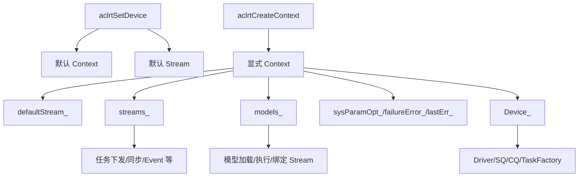

# Runtime Context 全局作用说明

## 1. 背景与定位

在 `runtime` 代码仓中，Context 是 Runtime 运行时资源的核心组织单元。对外 API 中它表现为 `aclrtContext`，在头文件里定义为不透明指针：

```cpp
typedef void *aclrtContext;
```

对应位置：`include/external/acl/acl_base_rt.h`。

在 Runtime 内部，`aclrtContext` 会被转换为 `cce::runtime::Context *`，其类定义位于：

- `src/runtime/core/inc/context/context.hpp`
- `src/runtime/core/inc/context/context_manage.hpp`

一句话概括：**Context 是某个 Device 上一次运行环境的承载对象，也是当前线程访问 Runtime 资源时的全局入口。** 绝大多数 Stream、Event、Model、任务下发、默认流、错误状态、部分系统参数和调试/Profiling 行为，都需要通过“当前 Context”找到所属设备与资源集合。

## 2. Context 在 API 层的语义

主要 ACL Runtime 接口位于 `include/external/acl/acl_rt.h`：

| 接口 | 作用 |
| --- | --- |
| `aclrtCreateContext(aclrtContext *context, int32_t deviceId)` | 在指定 device 上显式创建 Context，并把它关联到调用线程 |
| `aclrtDestroyContext(aclrtContext context)` | 销毁显式创建的 Context |
| `aclrtSetCurrentContext(aclrtContext context)` | 设置当前线程正在使用的 Context |
| `aclrtGetCurrentContext(aclrtContext *context)` | 获取当前线程正在使用的 Context |
| `aclrtSetDevice(int32_t deviceId)` | 指定 Device，并隐式创建默认 Context 与默认 Stream |
| `aclrtResetDevice/aclrtResetDeviceForce` | 释放 Device 上默认 Context、默认 Stream 及默认 Context 下相关资源 |

接口注释中明确了几个关键规则：

1. 如果没有显式调用 `aclrtCreateContext`，系统会使用 `aclrtSetDevice` 时隐式创建的默认 Context。
2. 一个进程内可以创建多个 Context，但同一线程同一时刻只能使用其中一个。
3. 多次调用 `aclrtSetCurrentContext` 时，最后一次设置生效。
4. 默认 Context 不能通过 `aclrtDestroyContext` 释放，而应随 `aclrtResetDevice` 释放。
5. 显式创建的 Event、Stream、Context 推荐按 Event/Stream -> Context -> ResetDevice 的顺序释放。

## 3. 源码调用链

### 3.1 ACL/RT API 到内部实现

外层 API 最终会进入 `src/runtime/api/api_c.cc`：

```cpp
rtError_t rtCtxCreate(rtContext_t *createCtx, uint32_t flags, int32_t devId)
{
    Api * const apiInstance = Api::Instance();
    const rtError_t error = apiInstance->ContextCreate(RtPtrToPtr<Context **>(createCtx), devId);
    ...
}

rtError_t rtCtxSetCurrent(rtContext_t currentCtx)
{
    Context * const ctx = static_cast<Context *>(currentCtx);
    Api * const apiInstance = Api::Instance();
    const rtError_t error = apiInstance->ContextSetCurrent(ctx);
    ...
}
```

核心实现位于 `src/runtime/core/src/api_impl/api_impl.cc`：

```cpp
rtError_t ApiImpl::ContextCreate(Context ** const inCtx, const int32_t devId)
{
    ...
    error = NewContext(static_cast<uint32_t>(devId), tsId, inCtx);
    ContextManage::InsertContext(*inCtx);
    error = ContextSetCurrent(*inCtx);
    ...
}

rtError_t ApiImpl::ContextSetCurrent(Context * const inCtx)
{
    InnerThreadLocalContainer::SetCurCtx(inCtx);
    InnerThreadLocalContainer::SetCurRef(nullptr);  // must be null for context switch
    return RT_ERROR_NONE;
}

rtError_t ApiImpl::ContextGetCurrent(Context ** const inCtx)
{
    *inCtx = Runtime::Instance()->CurrentContext();
    ...
}
```

由此可见，显式创建 Context 后，Runtime 会：

1. 创建内部 `Context` 对象；
2. 通过 `ContextManage::InsertContext` 纳入全局 Context 管理集合；
3. 调用 `ContextSetCurrent`，把它设置到当前线程的线程局部状态中。

### 3.2 Context 类承载的核心资源

`Context` 类中可以看到很多资源和状态字段：

```cpp
class Context : public NoCopy {
public:
    Stream *DefaultStream_() const;
    Stream *OnlineStream_() const;
    Device *Device_() const;
    bool IsPrimary() const;
    const std::list<Stream *> StreamList_() const;
    const std::list<Model *> &GetModelList() const;
    rtError_t CtxSetSysParamOpt(...);
    rtError_t CtxGetSysParamOpt(...);
    rtError_t SyncAllStreamToGetError();
    ...

private:
    Device *device_;
    Stream *defaultStream_;
    Stream *onlineStream_;
    std::list<Stream *> streams_;
    std::list<Model *> models_;
    void *overflowAddr_;
    std::vector<std::pair<bool, int64_t>> sysParamOpt_;
    Atomic<rtError_t> failureError_;
    Atomic<rtError_t> lastErr_;
    rtStreamCaptureMode captureMode_;
    ...
};
```

因此 Context 并不是一个简单句柄，它实际承担了“设备运行上下文 + 资源容器 + 状态隔离边界”的角色。

## 4. Context 的全局作用

### 4.1 作为当前线程的全局运行入口

Runtime 中大量 API 会先获取当前 Context：

```cpp
Context * const curCtx = CurrentContext();
CHECK_CONTEXT_VALID_WITH_RETURN(curCtx, RT_ERROR_CONTEXT_NULL);
```

这说明 Context 是很多操作的隐式入参。用户调用一些接口时不一定显式传入 `context`，但 Runtime 会通过线程局部的“当前 Context”判断：

- 当前操作属于哪个 Device；
- 应该使用哪个默认 Stream；
- Stream/Event/Model 是否属于当前 Context；
- 任务应该下发到哪套设备资源；
- 错误状态应该记录到哪个上下文。

所以从使用者视角看，Context 具有“全局当前状态”的效果；从实现视角看，这个“全局”主要是**线程局部全局状态**，由 `InnerThreadLocalContainer::SetCurCtx` 维护。

### 4.2 作为 Device 资源归属边界

Context 创建时绑定 `deviceId`，内部保存 `Device *device_`。通过 `Context::Device_()`，Runtime 可以从当前 Context 找到设备对象，再访问设备驱动、任务工厂、SQ/CQ、错误处理和硬件能力等。

例如 `ContextGetDevice` 的实现会从当前 Context 取出内部设备 ID，再转换为用户设备 ID：

```cpp
Context * const curCtx = CurrentContext();
const uint32_t drvDeviceId = curCtx->Device_()->Id_();
Runtime::Instance()->GetUserDevIdByDeviceId(drvDeviceId, &deviceId);
```

因此，Context 是 Device 资源的逻辑使用边界：同一个 Device 上可以有多个 Context，但每个 Context 都明确归属于某个 Device。

### 4.3 作为 Stream 的创建、默认流和同步入口

Context 中保存了：

- `defaultStream_`：默认流；
- `onlineStream_`：在线任务相关流；
- `streams_`：该 Context 下创建的 Stream 列表。

当用户没有显式传入 Stream 时，Runtime 通常会回退到当前 Context 的默认流。例如 `StreamSynchronize` 中：

```cpp
Context * const curCtx = CurrentContext();
...
if (curStm == nullptr) {
    curStm = curCtx->DefaultStream_();
}
```

这也是样例中“给函数传入空即使用默认流”的原因。Context 创建和 `aclrtSetDevice` 的默认 Context 机制，都会使默认流成为 Runtime 任务下发的隐式载体。

同时，Stream 和 Context 有绑定关系。部分代码会校验 stream 是否属于当前 Context，例如内存池异步分配中：

```cpp
COND_RETURN_ERROR_MSG_INNER(stm->Context_() != Runtime::Instance()->CurrentContext(),
    RT_ERROR_STREAM_CONTEXT,
    "Memory allocated failed, stream is not in current ctx...");
```

这说明 Context 也负责防止跨上下文误用 Stream。

### 4.3.1 Context 与 Stream 的关系详解

可以把二者关系理解为：**Context 是运行环境和资源容器，Stream 是挂在该 Context 下的任务执行队列。** Context 决定“在哪个设备、哪个运行环境下执行”，Stream 决定“该 Context 内的任务按什么队列顺序执行”。

#### 1. Stream 创建依赖当前 Context

`aclrtCreateStream` / `rtStreamCreate` 这类接口本身通常不显式传入 Context，内部会先获取当前线程的 `CurrentContext()`：

```cpp
rtError_t ApiImpl::StreamCreate(Stream ** const stm, const int32_t priority, const uint32_t flags, DvppGrp *grp)
{
    Context * const curCtx = CurrentContext();
    CHECK_CONTEXT_VALID_WITH_RETURN(curCtx, RT_ERROR_CONTEXT_NULL);

    Device *const dev = curCtx->Device_();
    ...
    rtError_t error = curCtx->StreamCreate(static_cast<uint32_t>(priority), flags, stm, grp, false, isAutoSplitEnable);
    ...
}
```

这说明：

- 创建 Stream 前必须有当前 Context；
- 新 Stream 会归属于创建时的当前 Context；
- Stream 所在 Device 也由该 Context 间接决定；
- 同一个 Device 上的不同 Context 创建出的 Stream，虽然物理设备相同，但 Runtime 仍把它们视为不同上下文下的资源。

因此，`aclrtSetCurrentContext(ctx)` 不只是改变后续 API 的“默认设备”，还会影响后续创建出来的 Stream 归属。

#### 2. Context 持有 Stream 集合和默认流

`Context` 内部保存了三类与 Stream 相关的成员：

```cpp
Stream *defaultStream_;
Stream *onlineStream_;
std::list<Stream *> streams_;
```

它们分别承担不同角色：

| 成员 | 含义 | 典型用途 |
| --- | --- | --- |
| `defaultStream_` | 当前 Context 的默认流 | 用户未传入 Stream 时作为兜底执行队列 |
| `onlineStream_` | 在线执行路径可能使用的特殊流 | 特定执行/同步路径中的替代流 |
| `streams_` | 当前 Context 下显式创建的 Stream 列表 | 生命周期管理、遍历同步、错误聚合、资源清理 |

所以 Stream 不是全局散落的对象，而是挂在 Context 资源树下面。Context 销毁或 reset device 时，也会沿着这个资源树清理相关 Stream。

#### 3. 传入空 Stream 时会回退到当前 Context 的默认流

很多 Runtime API 接受可空 Stream。传入 `nullptr` 时，内部会使用当前 Context 的 `DefaultStream_()`：

```cpp
Stream *curStm = stm;
if (curStm == nullptr) {
    curStm = curCtx->DefaultStream_();
    NULL_STREAM_PTR_RETURN_MSG(curStm);
}
```

这带来两个重要结论：

1. **默认流不是进程级全局唯一流，而是 Context 级默认流。** 当前线程切换 Context 后，同样传入 `nullptr`，实际使用的默认流也会变化。
2. **不显式传 Stream 的 API 仍然依赖当前 Context。** 如果当前 Context 未设置或设置错误，任务就可能下发到错误的默认流，或者直接返回 Context 相关错误。

#### 4. Stream 操作通常要求 Stream 所属 Context 与当前 Context 一致

Stream 销毁、事件等待、Kernel Fusion、异步内存池等路径都会校验 `stream->Context_()` 是否等于当前 Context：

```cpp
Context * const curCtx = CurrentContext();
CHECK_CONTEXT_VALID_WITH_RETURN(curCtx, RT_ERROR_CONTEXT_NULL);
COND_RETURN_AND_MSG_INVALID_CONTEXT(stm->Context_() != curCtx,
    RT_ERROR_STREAM_CONTEXT,
    "stream " + std::to_string(stm->Id_()));
```

如果当前线程处于 Context A，却操作 Context B 创建的 Stream，就可能触发：

```text
RT_ERROR_STREAM_CONTEXT
```

这也是多 Context 程序中最容易踩坑的地方：**Stream 句柄本身携带归属 Context，但大多数 API 仍会以当前线程的 CurrentContext 作为校验基准。**

#### 5. Stream 同步路径存在兼容性的隐式 Context 切换

`StreamSynchronize` 是一个特殊例子。源码中如果发现当前 Context 与 Stream 所属 Context 不一致，会临时切换到 Stream 的 Context，同步完成后再切回原 Context：

```cpp
bool ctxSwitch = false;
if (curCtx != curStm->Context_()) {
    error = ContextSetCurrent(curStm->Context_());
    ctxSwitch = true;
}
...
errCode = curStm->Synchronize(false, timeout);
...
if (ctxSwitch) {
    error = ContextSetCurrent(curCtx);
}
```

这说明 Runtime 对部分历史或兼容场景做了容错：即使用户当前 Context 不匹配，也尝试根据 Stream 句柄找到正确 Context 完成同步。

但这不应被业务代码依赖，原因是：

- 不是所有 Stream API 都会自动切换；
- 隐式切换增加线程局部状态变化，排查问题更困难；
- 如果同步期间触发错误聚合，错误会归因到 Stream 所属 Context；
- 多线程场景下依赖隐式切换容易造成代码语义不清。

推荐做法仍然是：**操作某个 Stream 前，显式把当前线程设置到该 Stream 所属的 Context。**

#### 6. Context 是错误聚合边界，Stream 是错误产生和同步观察点

任务实际在 Stream 上排队执行，错误常在 Stream 同步、事件等待、任务 report 等路径暴露。但错误状态会进一步汇聚到 Context：

```cpp
if ((curStm->Device_()->GetIsRingbufferGetErr()) &&
    (curCtx->GetFailureError() == RT_ERROR_NONE) &&
    (curCtx->GetCtxMode() != CONTINUE_ON_FAILURE)) {
    errCode = curCtx->SyncAllStreamToGetError();
}
```

也就是说：

- Stream 是任务执行序列，也是很多异步错误被观察到的位置；
- Context 负责维护该上下文级别的失败状态、最近错误和所有 Stream 的错误同步；
- 一个 Stream 上的严重错误，可能会让整个 Context 进入失败/异常状态，影响同 Context 下其他 Stream 的后续操作。

#### 7. 多线程场景下，Context 不会随 Stream 自动传播

当前 Context 是线程局部状态。线程 A 中创建的 Context 和 Stream，在线程 B 中使用时，线程 B 不会自动继承线程 A 的当前 Context。

典型正确方式：

```cpp
// 线程 A
aclrtContext ctx = nullptr;
aclrtCreateContext(&ctx, deviceId);
aclrtStream stream = nullptr;
aclrtCreateStream(&stream);

// 线程 B
aclrtSetCurrentContext(ctx);
// 再使用 stream 下发任务或同步
```

如果线程 B 没有先设置 `ctx`：

- 创建新 Stream 会失败或挂到线程 B 的其他当前 Context；
- 操作线程 A 创建的 Stream 可能触发 `RT_ERROR_STREAM_CONTEXT`；
- 传入 `nullptr` 时使用的是线程 B 当前 Context 的默认流，而不是线程 A 的默认流。

#### 8. 生命周期上 Stream 应早于显式 Context 销毁

由于 Stream 归属于 Context，显式创建的资源推荐按下面顺序释放：

```text
Destroy Event / Destroy Stream -> Destroy explicit Context -> Reset Device -> Finalize
```

如果先销毁 Context，再继续使用其下 Stream，Stream 的 `Context_()` 指向的运行环境已经无效，容易出现无效句柄、上下文校验失败或资源释放异常。

#### 9. 关系小结

| 维度 | Context | Stream |
| --- | --- | --- |
| 抽象层级 | 设备运行环境 / 资源容器 | Context 内的任务执行队列 |
| 归属关系 | 绑定 Device，持有多个 Stream | 创建时绑定当前 Context |
| 默认行为 | 提供 `DefaultStream_()` | API 未传 Stream 时可能被默认流替代 |
| 并发语义 | 线程局部当前状态决定使用哪个 Context | 同一 Stream 内任务按队列顺序执行，不同 Stream 可并发/异步 |
| 校验关系 | 当前 Context 是很多 API 的隐式校验基准 | 操作时常要求 `stream->Context_() == CurrentContext()` |
| 错误关系 | 聚合上下文级错误状态 | 任务错误常在同步/等待/report 时暴露 |
| 生命周期 | 显式 Context 销毁会清理其资源树 | 应先于所属显式 Context 销毁 |

一句话总结：**Context 管“在哪个运行环境里”，Stream 管“这个环境里的任务按哪条队列执行”；Stream 必须归属于某个 Context，而当前线程设置的 Context 决定了默认流选择、Stream 创建归属和跨上下文使用是否合法。**

### 4.4 作为任务下发与模型资源的组织单元

`Context` 类提供大量任务、模型、图捕获相关能力：

- `LaunchKernel...`
- `ModelCreate/ModelDestroy`
- `ModelBindStream/ModelUnbindStream`
- `StreamBeginCapture/StreamEndCapture`
- `CallbackLaunch`
- `NopTask`
- `FftsPlusTaskLaunch`
- `RDMASend`

内部还有 `models_` 列表、`captureMode_`、`captureLock_` 等状态。说明模型、图捕获、任务组等高级运行时资源也是按 Context 组织和隔离的。

实际模型执行中也大量使用 `context_->DefaultStream_()`，例如模型加载、绑定、同步、执行流选择等路径会把 Context 的默认流作为兜底执行流。

### 4.5 作为错误状态和异常传播边界

Context 内部维护：

- `failureError_`：上下文失败状态；
- `lastErr_`：上下文最近错误；
- `ctxMode_`：遇错处理模式；
- `SyncAllStreamToGetError()`：同步所有流以获取错误。

在 Stream 同步路径中，如果设备 ringbuffer 报错，并且当前 Context 还没有失败错误，Runtime 会调用：

```cpp
curCtx->SyncAllStreamToGetError();
```

这说明 Context 是错误状态的聚合点。一个 Context 下的 Stream/任务异常，可以被记录到该 Context，并影响该 Context 后续操作。

### 4.6 作为系统参数与调试状态的上下文级配置点

ACL API 提供了：

- `aclrtCtxGetSysParamOpt`
- `aclrtCtxSetSysParamOpt`

区别于进程级的 `aclrtGetSysParamOpt/aclrtSetSysParamOpt`，这类接口明确作用于当前 Context。内部 `Context` 也保存 `sysParamOpt_`。

此外，Context 还保存溢出检测相关地址：

- `overflowAddr_`
- `overflowAddrOffset_`

并提供 `CtxGetOverflowAddr()` 等接口。由此可见，一些调试、数值状态、系统行为配置是按 Context 隔离的。

### 4.7 作为生命周期和资源回收边界

显式创建的 Context 在销毁时会走：

```cpp
rtError_t ApiImpl::ContextDestroy(Context * const inCtx)
{
    CHECK_CONTEXT_VALID_WITH_RETURN(inCtx, RT_ERROR_CONTEXT_NULL);
    COND_RETURN_ERROR_MSG_INNER(inCtx->IsPrimary(), RT_ERROR_CONTEXT_NULL, "Can not destroy primary ctx.");
    COND_RETURN_ERROR_MSG_INNER(!inCtx->TearDownIsCanExecute(), RT_ERROR_CONTEXT_DEL, "Ctx is destroying.");

    ...
    const rtError_t error = inCtx->TearDown();
    ...
    ContextManage::EraseContextFromSet(inCtx);
    if (inCtx->ContextOutUse() == 0U) {
        delete inCtx;
    }
}
```

Context 销毁不仅释放句柄本身，还会触发 `TearDown()`，清理该 Context 关联的流、模型、回调线程、模块池等资源。默认 Context 或 Primary Context 不能用 `aclrtDestroyContext` 销毁，而由设备 reset 流程统一清理。

## 5. 默认 Context 与显式 Context

### 5.1 默认 Context

调用 `aclrtSetDevice(deviceId)` 时，Runtime 会隐式创建默认 Context 和默认 Stream。适合简单程序：

```cpp
aclInit(nullptr);
aclrtSetDevice(0);
// 未显式创建 context，后续操作使用默认 context
...
aclrtResetDevice(0);
aclFinalize();
```

特点：

- 使用简单；
- 与 device 生命周期绑定；
- 不能通过 `aclrtDestroyContext` 显式销毁；
- reset device 时释放默认 Context、默认 Stream 及默认 Context 下相关资源。

### 5.2 显式 Context

调用 `aclrtCreateContext(&ctx, deviceId)` 创建：

```cpp
aclInit(nullptr);
aclrtSetDevice(deviceId);
aclrtCreateContext(&ctx, deviceId);
aclrtSetCurrentContext(ctx);
...
aclrtDestroyContext(ctx);
aclrtResetDevice(deviceId);
aclFinalize();
```

特点：

- 可以在同一进程中创建多个 Context；
- 同一线程同一时刻只能有一个当前 Context；
- 适合多线程、多模型、多设备或需要明确隔离资源的场景；
- 创建后会自动成为创建线程的当前 Context，但跨线程使用时仍建议显式 `aclrtSetCurrentContext`。

## 6. 多线程场景下的全局作用

Context 的“当前上下文”不是进程级单一全局变量，而是线程局部状态。源码中的 `ContextSetCurrent` 调用：

```cpp
InnerThreadLocalContainer::SetCurCtx(inCtx);
```

说明每个线程都可以有自己的当前 Context。

典型规则：

1. 线程 A 创建的 Context 可以传给线程 B 使用。
2. 线程 B 使用前应调用 `aclrtSetCurrentContext(ctx)`。
3. 如果多个线程共享同一个 Context，并操作同一个 Stream，用户需要保证任务顺序。
4. 对于回调处理线程、report 线程等，样例中也会先设置当前 Context：

```cpp
aclrtSetCurrentContext(context_);
aclrtProcessReport(waitTime);
```

这说明很多后台或辅助线程同样依赖“当前 Context”来正确处理任务报告、回调和状态。

## 7. Context 与 Stream/Event/Memory/Model 的关系



关系总结：

| 资源 | 与 Context 的关系 |
| --- | --- |
| Device | Context 创建时绑定 Device，内部通过 `Device_()` 访问设备资源 |
| Stream | 在 Context 下创建，保存于 `streams_`；空 Stream 参数通常使用 `defaultStream_` |
| Event/Notify | 通常与 Stream/Context 的任务序列关联，销毁顺序应早于 Context |
| Memory | 设备内存和内存池操作依赖当前 Context 与 Stream 所属 Context 的一致性 |
| Model | Model 归属于 Context，执行时常使用 Context 默认流或 Context 内的 Stream |
| Callback/Report | 处理线程需要设置当前 Context，才能正确处理对应流和任务报告 |
| Profiling/DFX | Profiling、coredump、debug 等路径常通过当前 Context 获取设备与上下文状态 |

## 8. 常见误用与风险

### 8.1 未设置当前 Context

如果线程中没有当前 Context，很多 API 会返回 `RT_ERROR_CONTEXT_NULL` 或 ACL 层对应错误。尤其是新线程、回调线程、report 线程中，不能假设主线程的当前 Context 自动生效。

### 8.2 Stream 与当前 Context 不一致

有些接口会严格检查 Stream 所属 Context 是否等于当前 Context。若在 Context A 当前状态下使用 Context B 创建的 Stream，可能触发 `RT_ERROR_STREAM_CONTEXT`，或者发生隐式 Context 切换。

例如 `StreamSynchronize` 中发现当前 Context 与 Stream 所属 Context 不一致时，会临时切换到 Stream 的 Context，执行完再切回：

```cpp
if (curCtx != curStm->Context_()) {
    error = ContextSetCurrent(curStm->Context_());
    ctxSwitch = true;
}
...
if (ctxSwitch) {
    error = ContextSetCurrent(curCtx);
}
```

这类隐式切换虽然提高兼容性，但会增加理解成本，因此业务代码仍建议显式设置正确 Context。

### 8.3 销毁顺序错误

推荐顺序：

```text
Destroy Event / Destroy Stream -> Destroy explicit Context -> Reset Device -> Finalize
```

如果先 reset device，再设置或使用该 Device 对应 Context，接口注释中说明可能导致业务异常。

### 8.4 销毁默认 Context

默认 Context 是 `aclrtSetDevice` 隐式创建的，不能用 `aclrtDestroyContext` 释放，应由 `aclrtResetDevice` 或 `aclrtResetDeviceForce` 统一释放。

### 8.5 多线程共享同一个 Stream

接口注释中明确：如果线程 A 创建 Context，线程 B 使用该 Context，用户必须保证同一 Context 下同一 Stream 中任务执行顺序。否则容易出现任务乱序、同步困难或错误归因不清。

## 9. 推荐使用模式

### 9.1 单线程简单程序

```cpp
aclInit(nullptr);
aclrtSetDevice(deviceId);

// 使用默认 Context 和默认 Stream
...

aclrtResetDevice(deviceId);
aclFinalize();
```

### 9.2 显式 Context 程序

```cpp
aclInit(nullptr);
aclrtSetDevice(deviceId);

aclrtContext ctx = nullptr;
aclrtCreateContext(&ctx, deviceId);
aclrtSetCurrentContext(ctx);

aclrtStream stream = nullptr;
aclrtCreateStream(&stream);

// 任务下发、内存申请、模型执行等
...

aclrtDestroyStream(stream);
aclrtDestroyContext(ctx);
aclrtResetDevice(deviceId);
aclFinalize();
```

### 9.3 多线程共享 Context

```cpp
// 主线程
aclrtCreateContext(&ctx, deviceId);

// 工作线程入口
void Worker(aclrtContext ctx) {
    aclrtSetCurrentContext(ctx);
    // 后续 Runtime API 都在该 Context 下执行
}
```

## 10. 一句话总结

Context 在 runtime 仓中的全局作用可以理解为：

> **Context 是 Runtime 对“当前线程正在使用哪个设备运行环境”的全局描述。它绑定 Device，持有默认流和资源列表，隔离 Stream/Model/错误/系统参数，并作为大多数 Runtime API 的隐式上下文入口。**

理解 Context 后，再看 Stream、Event、Memory、Model 等模块，会发现它们大多不是孤立资源，而是挂靠在 Context 这棵资源树下完成创建、校验、调度、同步和释放。

## 11. 关键源码索引

| 文件 | 关注点 |
| --- | --- |
| `include/external/acl/acl_base_rt.h` | `aclrtContext` 不透明句柄定义 |
| `include/external/acl/acl_rt.h` | Context/Device 对外 API 语义和限制说明 |
| `src/runtime/api/api_c.cc` | C API 到内部 `Api`/`Context` 的适配 |
| `src/runtime/api/api_c_context.cc` | RTS Context API 包装 |
| `src/runtime/core/src/api_impl/api_impl.cc` | `ContextCreate/Destroy/SetCurrent/GetCurrent` 核心实现 |
| `src/runtime/core/inc/context/context.hpp` | `Context` 类资源与状态定义 |
| `src/runtime/core/inc/context/context_manage.hpp` | Context 全局集合、有效性校验、设备级清理 |
| `example/1_basic_features/context/README.md` | Context 基础样例入口 |
| `example/2_advanced_features/callback/*` | 多线程/回调线程中设置当前 Context 的样例 |

